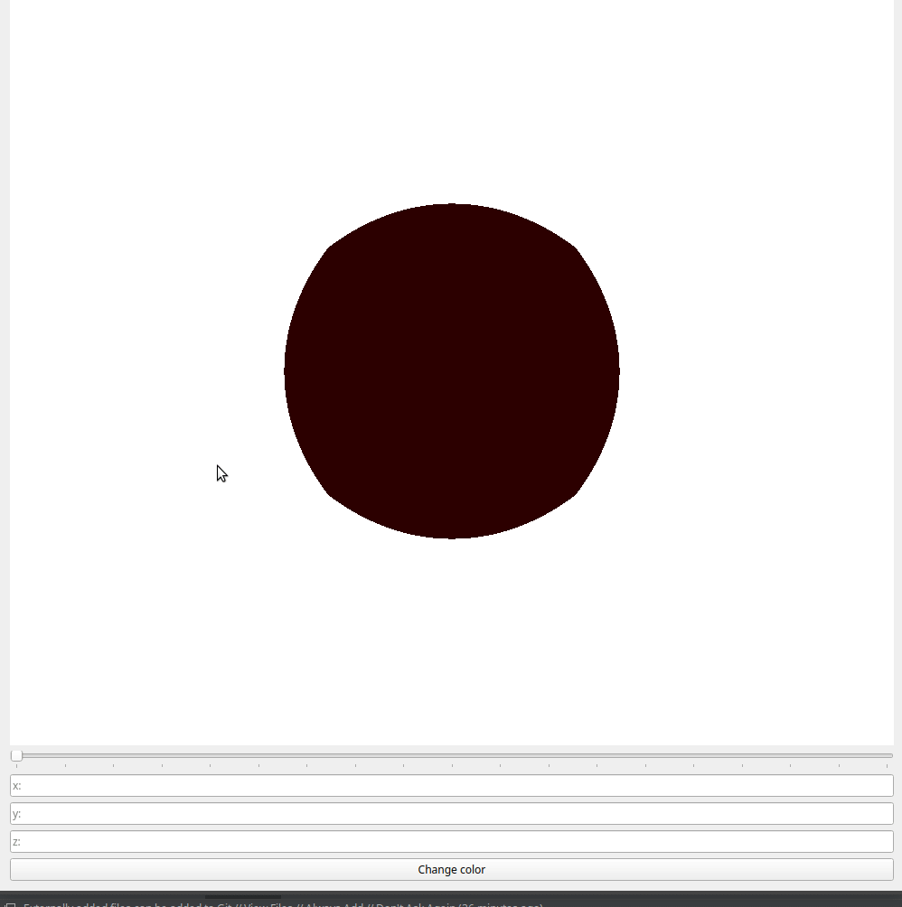

# Projects
## Matrix operations

### What is it?
Command line utility for matrix addition and multiplication. Accepts as command line arguments a list of files with matrices separated by command-operations.

Matrix file format:
```
M N
a1_1 ... a1_N
.        .
.        .
.        .
aM_1 ... aM_N
```
On the first line of the file
two natural numbers M and N are indicated — respectively, the number of rows and columns in the matrix.
Followed by M lines of N floats separated by spaces.

### Build

```bash
cd MatrixOperations/
make
```

### Test

```bash
cd MatrixOperations/smoke_tests
./smoke_test.sh ../matrices
```

If you have Valgrind installed then look at lines in `MatrixOperations/smoke_tests/smoke_test.sh`

### Example usage
```bash
./matrices m1.txt -add m2.txt --mult m3.txt --mult m4.txt
```

The result will be displayed on the screen.

## Gaussian Filter

### What is it?
Command line utility that filters an image using a [Gaussian filter](https://en.wikipedia.org/wiki/Gaussian_blur). The input accepts a 3-channel BMP image.

### Build

```bash
cd GaussianFilter/
make
```

### Test

The tests are presented only for visual comparison of the similarity of the images obtained by the `opencv` library and this utility.

Original images: `GaussianFilter/visual_test/img`

Requires: `Python3` and `pip`

```bash
cd GaussianFilter/visual_test
sh run.sh
```

You get a set of directories like `dest-r` where r -- convolution kernel size.
Each of the images in these directories was obtained by applying a Gaussian filter from the `opencv` library.

Now you can run the utility with the same parameters and compare the results.

### Example usage

```bash
cd GaussianFilter/
./blur -i visual_test/img/2.bmp -o my_result.bmp -r 25
```

Command line options:
* `-i <path-to-image>` relative or absolute path to the input image in BMP format;
* `-o <path-to-image>` relative or absolute path to the resulting image in BMP format;
* `-r <size-in-pixels>` convolution kernel size (must be odd and less than image dimensions).


## Geometry morphing

### What is it?
Qt-application demonstrating the morphing of a unit cube into a unit sphere.

### Build
Requires: [Qt5](https://doc.qt.io/qt-5/)

Make sure you have shader `version 330` by default.

```bash
cd GeometryMorphing/
cmake
make
```

### Example usage
```bash
./morph -t 0.5
```

For help: `./morph -h` (all options are optional)

You can change the axis of rotation, change the color of the shape and use the slider if you turn off the animation.

